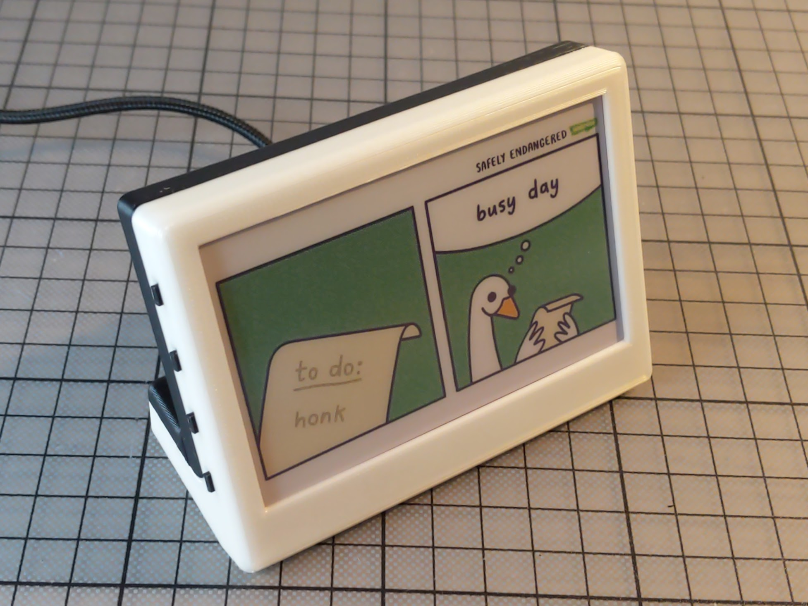
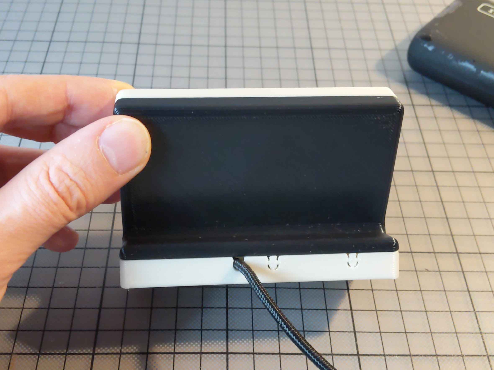
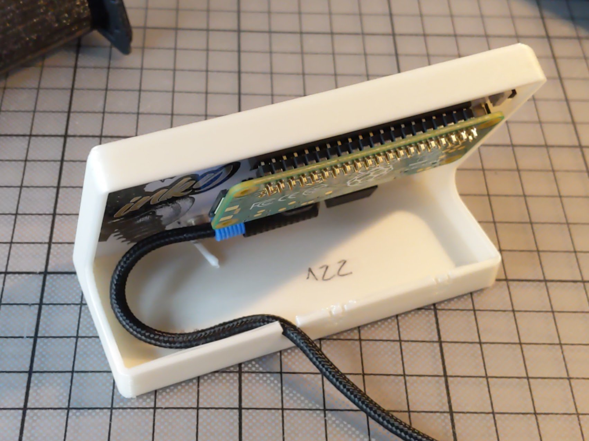

# Image frame for pimoroni Inky Impression 4" (7 colour ePaper/eInk HAT)
Use pimoroni [pimoroni Inky Impression 4"](https://shop.pimoroni.com/products/inky-impression-4) as images frame.

Button controls:
* A - random image
* B - next image
* C - previous image
* D - switch between gif and logos folders

# Demo
[](https://www.youtube.com/watch?v=NzTFW20K8aU&list=PLFmnthuksGmwWCHfQgqcG0MAFofTl0-mO&index=1)


# 3d printed case




* order the case on [shapeways](https://www.shapeways.com/product/WHY25YGN8/desktop-case-for-pimoroni-inky-impression-4-quot)
* or print by yourself [cults3d](https://cults3d.com/en/3d-model/gadget/desktop-case-for-pimoroni-inky-impression-4-7-colour-epaper-eink-hat-and-raspberry-pi-zero-3-a)
* follow me on Twitter [@printminion](https://twitter.com/printminion)

# Setup
````bash
git clone https://github.com/printminion/pimoroni-Inky-Impression-4-image-frame.git
pip3 install -r requirements.txt
````
* add images (preferably 640x400) to folders:
  * `defauls` -  put `png` or `jpg` files which will be shown on boot.
  * `stills` - put `png` or `jpg` files here.

You can use sub folders.

* add script to autostart
````bash
sudo nano /etc/rc.local
sudo /home/pi/pimoroni-Inky-Impression-4-image-frame/main.py 2>&1 | logger -t PRINTMINION &
sudo reboot now
````
